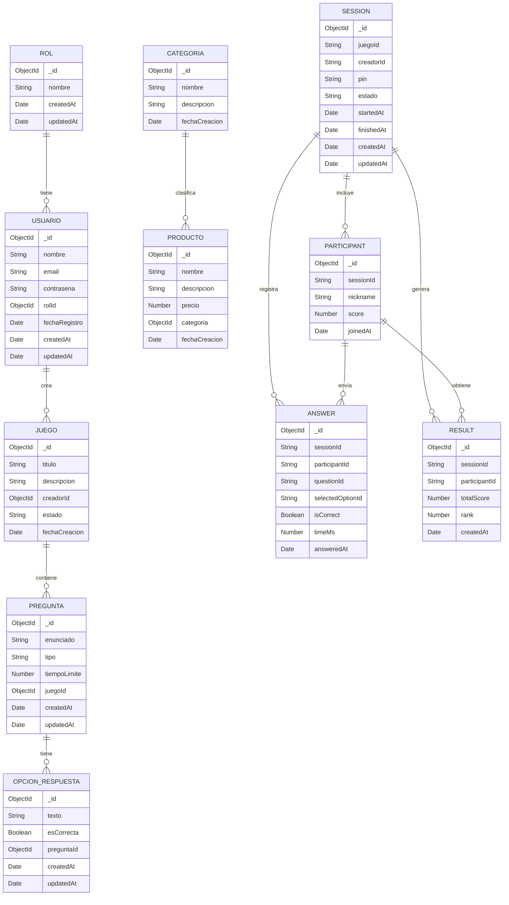

# Diagrama Entidad-Relación (DER) — Robin HOOT

> Representación del modelo de datos en **MongoDB** (colecciones, campos, tipos y relaciones).

---

## Diagrama

---

## Descripción de Colecciones

### `roles`
Catálogo de roles del sistema. Valor por defecto: `ESTUDIANTE`.

| Campo | Tipo | Requerido | Descripción |
|-------|------|-----------|-------------|
| `nombre` | String | ✅ | Nombre del rol (ej. `ESTUDIANTE`, `ADMIN`) |

---

### `usuarios`
Usuarios registrados en la plataforma.

| Campo | Tipo | Requerido | Descripción |
|-------|------|-----------|-------------|
| `nombre` | String | ✅ | Nombre completo |
| `email` | String | ✅ (único) | Email con formato válido |
| `contraseña` | String | ✅ | Hash bcrypt (mín. 6 caracteres) |
| `rolId` | ObjectId → Rol | ✅ | Referencia al rol asignado |
| `fechaRegistro` | Date | — | Fecha de registro (default: now) |

**Relación**: `Usuario.rolId` → `Rol._id` (N:1)

---

### `categorias`
Categorías que clasifican productos y juegos.

| Campo | Tipo | Requerido | Descripción |
|-------|------|-----------|-------------|
| `nombre` | String | ✅ (único) | Nombre de la categoría |
| `descripcion` | String | — | Descripción opcional |
| `fechaCreacion` | Date | — | Default: now |

---

### `productos`
Catálogo de recursos/cursos del sistema.

| Campo | Tipo | Requerido | Descripción |
|-------|------|-----------|-------------|
| `nombre` | String | ✅ | Nombre del producto |
| `descripcion` | String | — | Descripción opcional |
| `precio` | Number | ✅ | Precio del producto |
| `categoria` | ObjectId → Categoria | ✅ | Categoría a la que pertenece |
| `fechaCreacion` | Date | — | Default: now |

**Relación**: `Producto.categoria` → `Categoria._id` (N:1)

---

### `juegos`
Quizzes creados por los usuarios.

| Campo | Tipo | Requerido | Descripción |
|-------|------|-----------|-------------|
| `titulo` | String | ✅ | Título del juego |
| `descripcion` | String | — | Descripción opcional |
| `creadorId` | ObjectId → Usuario | ✅ | Usuario que creó el juego |
| `estado` | String (enum) | — | `BORRADOR` \| `PUBLICADO` |
| `fechaCreacion` | Date | — | Default: now |

**Relación**: `Juego.creadorId` → `Usuario._id` (N:1)

---

### `preguntas`
Preguntas asociadas a un juego.

| Campo | Tipo | Requerido | Descripción |
|-------|------|-----------|-------------|
| `enunciado` | String | ✅ | Texto de la pregunta |
| `tipo` | String (enum) | ✅ | `multiple` \| `verdadero/falso` |
| `tiempoLimite` | Number | ✅ | Segundos para responder (mín. 1) |
| `juegoId` | ObjectId → Juego | ✅ | Juego al que pertenece |

**Relación**: `Pregunta.juegoId` → `Juego._id` (N:1)

---

### `opcionrespuestas`
Opciones de respuesta de cada pregunta.

| Campo | Tipo | Requerido | Descripción |
|-------|------|-----------|-------------|
| `texto` | String | ✅ | Texto de la opción |
| `esCorrecta` | Boolean | ✅ | Si es la respuesta correcta |
| `preguntaId` | ObjectId → Pregunta | ✅ | Pregunta a la que pertenece |

**Relación**: `OpcionRespuesta.preguntaId` → `Pregunta._id` (N:1)

---

### `sessions`
Sesiones de juego en tiempo real.

| Campo | Tipo | Requerido | Descripción |
|-------|------|-----------|-------------|
| `juegoId` | String | ✅ | ID del juego asociado |
| `creadorId` | String | ✅ | ID del creador de la sesión |
| `pin` | String | ✅ (único, 6 chars) | PIN de acceso a la sala |
| `estado` | String (enum) | — | `CREADA` \| `ACTIVA` \| `FINALIZADA` |
| `startedAt` | Date | — | Fecha de inicio |
| `finishedAt` | Date | — | Fecha de finalización |

---

### `participants`
Participantes de una sesión.

| Campo | Tipo | Descripción |
|-------|------|-------------|
| `sessionId` | String | ID de la sesión |
| `nickname` | String | Nombre del jugador |
| `score` | Number | Puntaje acumulado |
| `joinedAt` | Date | Fecha de ingreso |

**Relación**: `Participant.sessionId` → `Session._id` (N:1)

---

### `answers`
Respuestas enviadas durante la sesión.

| Campo | Tipo | Descripción |
|-------|------|-------------|
| `sessionId` | String | ID de la sesión |
| `participantId` | String | Participante que respondió |
| `questionId` | String | Pregunta respondida |
| `selectedOptionId` | String | Opción seleccionada |
| `isCorrect` | Boolean | Si fue correcta |
| `timeMs` | Number | Tiempo de respuesta en ms |

---

### `results`
Resultados finales de participantes.

| Campo | Tipo | Descripción |
|-------|------|-------------|
| `sessionId` | String | ID de la sesión |
| `participantId` | String | Participante |
| `totalScore` | Number | Puntaje total |
| `rank` | Number | Posición en el ranking |

---

## Cardinalidad de Relaciones

| Relación | Tipo | Descripción |
|----------|------|-------------|
| `Rol` → `Usuario` | 1:N | Un rol puede tener muchos usuarios |
| `Usuario` → `Juego` | 1:N | Un usuario puede crear muchos juegos |
| `Categoria` → `Producto` | 1:N | Una categoría clasifica muchos productos |
| `Juego` → `Pregunta` | 1:N | Un juego tiene muchas preguntas |
| `Pregunta` → `OpcionRespuesta` | 1:N | Una pregunta puede tener hasta 4 opciones |
| `Session` → `Participant` | 1:N | Una sesión puede tener muchos participantes |
| `Session` → `Answer` | 1:N | Una sesión registra muchas respuestas |
| `Session` → `Result` | 1:N | Una sesión genera un resultado por participante |
